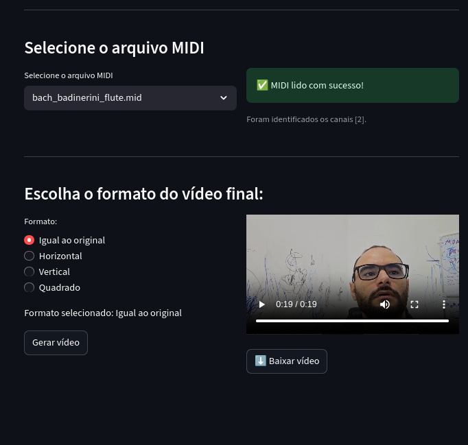

# 🎶 MIDI Video Composer

O **MIDI Video Composer** é um aplicativo web feito em [Streamlit](https://streamlit.io/) que permite sincronizar um vídeo com um arquivo MIDI.  
Você pode **enviar seus próprios vídeos e MIDIs**, ou escolher de uma lista de exemplos pré-carregados.  
Após processar, o app gera um novo vídeo sincronizado com a música e permite baixá-lo.

---

## 🚀 Funcionalidades

- 📹 **Upload ou escolha de vídeos**:  
  - O usuário pode enviar um vídeo (`.mp4`, `.mov`, `.avi`) ou selecionar de uma lista pré-definida na pasta `data/instruments`.

- 🎼 **Upload ou escolha de arquivos MIDI**:  
  - O usuário pode enviar seu próprio arquivo (`.mid` ou `.midi`) ou selecionar um da pasta `data/midis`.

- ⚙️ **Processamento automático**:  
  - O vídeo é analisado para extrair notas e sincronizar com o MIDI.  
  - Diferentes formatos de saída podem ser escolhidos: **Horizontal**, **Vertical**, **Quadrado** ou manter o formato original.

- 🎬 **Visualização e Download**:  
  - O resultado pode ser visualizado diretamente no navegador.  
  - Um botão de download disponibiliza o vídeo final em `.mp4`.

---

## 🖼️ Exemplos

### Interface principal


### Vídeo gerado e disponível para download


---

## 📂 Estrutura do Projeto

MIDI-Video-Composer/
│── app.py # Script principal do Streamlit
│── requirements.txt # Dependências do projeto
│── README.md # Este arquivo
│── src/
│ └── video_processing.py # Funções de processamento de vídeo e MIDI
│── data/
│ ├── instruments/ # Vídeos de exemplo
│ └── midis/ # Arquivos MIDI de exemplo


---

## 🛠️ Instalação e Uso

### 1. Clone o repositório
```bash
git clone https://github.com/seu-usuario/midi-video-composer.git
cd midi-video-composer
```
### 2. Crie um ambiente virtual

```bash
python -m venv .venv
source .venv/bin/activate   # Linux/Mac
.venv\Scripts\activate      # Windows
```

### 3. Instale as dependências

```bash
pip install -r requirements.txt
```
As vezes o tensorflow não é instalado junto, com o crepe, então adicione 

```bash
pip install tensorflow
```
### 4. Execute o aplicativo

```bash
streamlit run app.py
```

O streamlit vai abrir o navegador, com link local, geralmente em http://localhost:8501


## ⚡ Tecnologias Utilizadas

- [Python 3.9+](https://www.python.org/) – Linguagem principal  
- [Streamlit](https://streamlit.io/) – Criação da interface web  
- [MoviePy](https://zulko.github.io/moviepy/) – Processamento e composição de vídeos  
- [Mido](https://mido.readthedocs.io/) – Leitura e análise de arquivos MIDI  
- [Pandas](https://pandas.pydata.org/) – Estruturação e análise de dados (CSV gerados na pré-análise)  
- [FFmpeg](https://ffmpeg.org/) – Backend utilizado pelo MoviePy para operações de vídeo e áudio  

---

## 📌 Observações Importantes

- O processamento de vídeos pode levar **muitos minutos**, dependendo da resolução e duração do material enviado.  
- Os arquivos enviados pelo usuário e os resultados intermediários são salvos em **pastas temporárias**, que são apagadas automaticamente.  
- O idioma da interface é detectado automaticamente:
  - Navegadores configurados em **Português (pt-BR)** → Interface em Português  
  - Demais idiomas → Interface em Inglês  

---